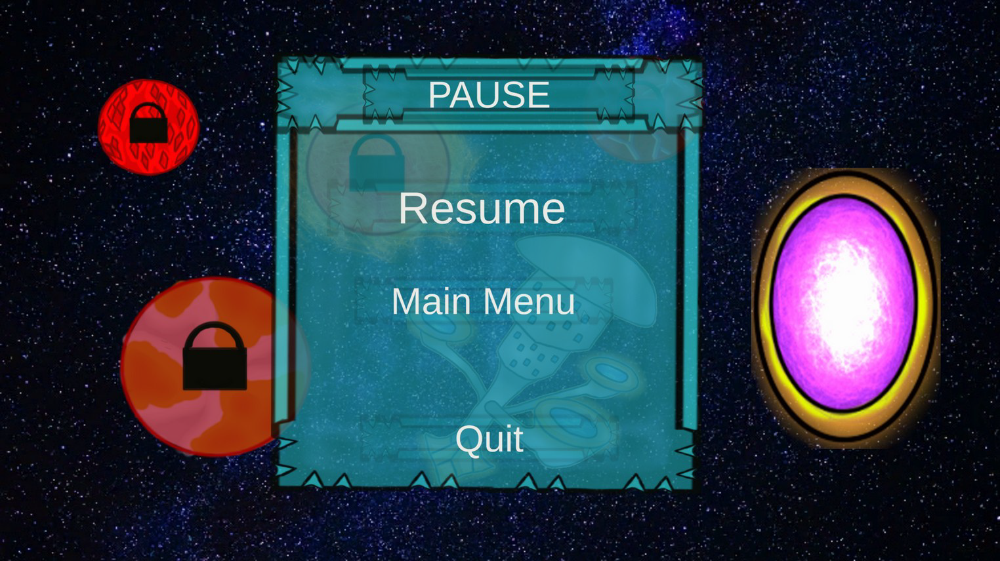

# Space Adventure

My bigest 2D game programed in C# and Unity.

## Description

# Plot

„Planet Coruss was my home. For many millennia my civilization has been
guarding peace across the cosmos. But nothing lasts forever … My home was destroyed
and I am the only survivor. Help me gather strength and prepare me for the final
confrontation.The Empire of the Eternal Flame is responsible for the death of my planet.
In order to defeat the enemy you must destroy its mothership. The mothership is being
guarded by a massive fleet, so you have to be prepared. In order to have a chance, you
must gather all fragments of the ancient artefact scattered across planets."

# Gameplay

As we read in the plot, the player's goal is to complete the ancient artifact. Its fragments are found on one on each planet, but you cannot access them arrive. This happens because the player's ship does not have the appropriate modifications that would allow him to travel such long distances. Fortunately, there is a station nearby space where you can purchase the necessary parts:

• Engine 1 - Gives you the ability to travel to Planet1. Price: 1000 credits.

• Engine 2 - Provides the ability to travel to Planet2. Price: 2000 credits.

• Engine 3 - Provides the ability to travel to Planet3. Price: 3000 credits.

• Engine 4 - Gives you the ability to travel to Planet4. Price: 4000 credits.

• Upgrade 1 - Increases your damage dealt to 10. Price: 200 credits.

• Upgrade 2 - Increases your damage dealt to 15. Price: 400 credits.

• Upgrade 3 - Increases your damage dealt to 20. Price: 600 credits.

• Upgrade 4 – Increases your HP to 600. Price: 1500 credits.

Credits are the in-game currency and can be earned by fighting enemies in space. Because the artifact fragments must be completed in the correct order
starting with the first one, which is on Planet 1, the course of the game should look like this:

1. The user earns credits by fighting in space.
2. If he is interested in increasing his chances of survival, he can buy it upgrades (Upgrade 1, Upgrade 2, Upgrade 3, Upgrade 4).
3. The player purchases Engine 1 and completes all levels on Planet 1 obtaining the first fragment of the artifact.
4. The player purchases Engine 2 and completes all levels on Planet 2 obtaining the second fragment of the artifact.
5. The player purchases Engine 3 and completes all levels on Planet 3 obtaining the third artifact fragment.
6. The player purchases Engine 4 and completes all levels on Planet 4 obtaining the fourth artifact fragment.
7. After collecting all the fragments, the artifact must be merged - the user can do this do on the space station, which will allow him to travel to where the mothership belonging to the Empire of the Eternal Flame is located.
8. Then the player destroys the fleet defending the mother ship, gets on board and destroys the main reactor, resulting in an explosion that destroys the ship.
9. After destroying the mothership, a panel appears congratulating you on completing the game.
    
## Images

